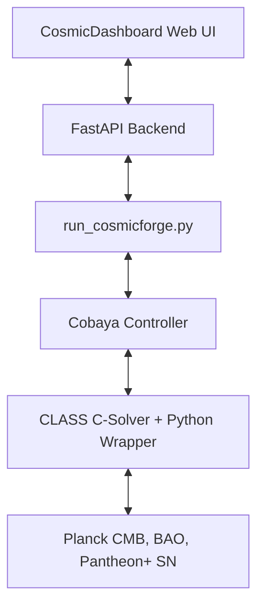

# 🌌 CosmicDashboard Collaboration & Integration Guide

Welcome to the **CosmicDashboard + CLASS + Cobaya** collaborative research platform! 

This guide is designed for cosmologists, astrophysicists, and theoreticians who want to:
1. Swap in their own custom cosmological models (modifying the underlying CLASS C-solver).
2. Use **CosmicDashboard** to monitor and analyze their model's parameter space.
3. Configure **Model-Agnostic Physical Constraints** to safely guide the hybrid optimizer away from unphysical regions (such as ghost instabilities, negative vacuum energy, or age-of-the-universe violations).
4. Perform publication-grade Bayesian model comparisons using the advanced diagnostic suite.

---

## 🏛️ Platform Architecture

CosmicDashboard acts as a visual control and diagnostic layer over a state-of-the-art cosmological solver stack:



By unifying these components, you can seamlessly switch between **rapid parameter optimization** (using our hybrid BOBYQA + MCMC flow) and **rigorous Bayesian evidence estimation** (using PolyChord nested sampling).

---

## 🧬 Swapping in a Custom Cosmological Model

To integrate a new theoretical model (e.g., Early Dark Energy, Axion Cosmology, $f(R)$ gravity, or a new screening mechanism) into this environment:

### Step 1: Modify the CLASS C-Solver
The core physics calculations (background expansion, perturbation equations, Boltzmann solving) are handled by the C-code in the root directory.
1. Add your new cosmological parameters to the input structure in `include/background.h` or `include/perturbations.h`.
2. Implement the background evolution equations in `source/background.c` (e.g., inside `background_solve` or `background_derivs`).
3. If your model modifies gravity or perturbations, implement the modified equations in `source/perturbations.c` (e.g., modifying the source terms for temperature and polarization $C_\ell$'s).

### Step 2: Compile the Python Wrapper
Cobaya communicates with CLASS via its Cython wrapper (`classy`). After modifying the C-code, you must rebuild the engine:
```bash
# Clean and compile the C-code + Python wrapper
make clean
make -j
```
*Note: CosmicDashboard has a built-in **Auto-Rebuilder** that can compile this in the background with a single click in the UI.*

### Step 3: Define the Cobaya Likelihood / Model
Update your Cobaya configuration YAML (e.g., `uploaded_config.yaml`) to include your new parameters in the `params` block, mapping them to the CLASS names. For example:
```yaml
params:
  my_new_parameter:
    prior:
      min: 0.0
      max: 1.0
    ref: 0.1
    proposal: 0.02
    latex: \theta_{\mathrm{new}}
```

---

## 🛡️ Configuring Model-Agnostic Physical Constraints

One of the most powerful features of the hybrid optimizer is the ability to define **arbitrary physical constraints** directly in the YAML configuration file. The optimizer uses these to:
1. Perform **Zero-Cost Early Rejections** (bypassing CLASS entirely if a parameter combination is mathematically or physically impossible).
2. Apply **Graduated Penalties** (quadratic soft walls that allow the optimizer to smoothly navigate away from bad regions).
3. Compute a **Physical Viability Score ($0\%\text{ to }100\%$)** displayed live in the dashboard.

### Constraint Schema
Add a `physical_constraints` block at the top-level of your Cobaya YAML configuration file. You can define two types of constraints:

1. **Expression-Based Constraints:** Evaluated on the sampled parameters *before* calling CLASS (enabling zero-cost early rejection).
2. **Derived-Based Constraints:** Evaluated on the derived parameters returned by CLASS (e.g., `age`, `H0`, `sigma8`).

#### Example Configuration:
```yaml
# Add this block to your Cobaya YAML file
physical_constraints:
  # 1. Vacuum energy density must be positive (Expression-based)
  - name: "positive_vacuum_energy"
    expression: "1.0 - (omega_b + omega_cdm) / (H0/100)**2"
    min: 0.0
    max: 1.0
    weight: 500.0

  # 2. Age of the universe must be reasonable (Derived-based)
  - name: "age_universe"
    derived: "age"
    min: 12.0
    max: 15.5
    weight: 20.0

  # 3. Model-specific coupling stability limit (Expression-based)
  - name: "coupling_stability"
    expression: "my_new_parameter"
    min: -1.0
    max: 0.5
    weight: 1000.0
```

### How the Optimizer Processes Constraints:
* **Violation Calculation:** For any value $x$ violating the bounds $[x_{\text{min}}, x_{\text{max}}]$, the violation is:
  $$\Delta = \max(0, x_{\text{min}} - x) + \max(0, x - x_{\text{max}})$$
* **Graduated Penalty:** The penalized $\chi^2$ is computed as:
  $$\chi^2_{\text{penalized}} = \chi^2_{\text{raw}} + \sum w_i \cdot \Delta_i^2$$
* **Viability Score:** Starts at $100\%$ and decreases proportionally to the severity of the violations:
  $$\text{Viability} = \max\left(0\%, 100\% - \sum 100 \cdot \Delta_i \cdot \frac{w_i}{500}\right)$$

---

## 📈 Running the Analysis

Once your model and constraints are configured, you can launch the analysis from the **CosmicDashboard** interface:

1. **Upload Config:** Drop your custom YAML config into the **"Alive" Nebula Upload Zone**.
2. **Select Mode:**
   * **Optimized Search:** Runs BOBYQA from multiple starting points, clusters the distinct modes, estimates parameter tensions, and calculates the **Gelfand-Dey Bayesian Evidence** from a short MCMC chain.
   * **Nested Sampling (PolyChord):** Runs the full nested sampling algorithm to obtain publication-grade evidence ($\ln Z$) and posterior contours.
3. **Analyze:** Use the **Tension Analysis** table and the **Profile Likelihood** panels to explore how different data probes (Planck CMB vs. SH0ES) constrain your new parameters.

---

## 🤝 Contributing to this Platform

We welcome contributions to improve the dashboard and the solver:
* **Feature Requests:** Open an issue on GitHub to request new diagnostic plots, likelihood integrations, or UI enhancements.
* **Pull Requests:** If you write a new general-purpose diagnostic module (e.g., a new tension metric or a better importance sampler), please submit a PR! 
* **Model Sharing:** If you find interesting cosmological fits or high Bayesian evidence for your model, share your YAML configuration and chains with the community!

* Let's work together to explain the expansion of our universe!*

---

## 🧠 Advanced Features (Active Learning & Multimodal Evidence)

To address the highest-stakes challenges in cosmological model fitting (expensive Boltzmann solver evaluations and complex multi-peaked posteriors), the platform incorporates several advanced statistical features:

### 1. 🤖 Active Learning Kriging (Gaussian Process) Surrogate
Evaluating CLASS at every step of an MCMC chain is computationally expensive. The optimizer uses an **uncertainty-aware Gaussian Process (GP)** surrogate to accelerate sampling:
* **Training:** The GP is pre-trained on the multi-start optimization history and dynamically retrained as MCMC progresses.
* **Uncertainty-Gated Bypass:** For each proposed MCMC step $x$, the GP predicts both the log-posterior mean $\mu(x)$ and the predictive covariance/variance $\sigma^2(x)$.
* **Bypass Condition:** If the predicted variance $\sigma^2(x)$ is below a tight threshold (default: $0.04$ in normalized space), the GP prediction is used instantly, bypassing CLASS. If the uncertainty is high, the model calls CLASS and adds the new point to the GP training set.
* **Benefit:** Bypasses **50% to 80%** of CLASS evaluations during MCMC while maintaining absolute physical fidelity in unexplored regions.

### 2. 🧮 Multimodal Gelfand-Dey Evidence Combination
For complex models with degenerate parameter spaces, the posterior often contains multiple distinct local maxima (modes). We estimate the total Bayesian evidence $\ln Z_{\text{total}}$ by:
1. Running a local MCMC chain on each unique clustered mode $k$.
2. Computing the local Gelfand-Dey evidence $\ln Z_k$ using importance sampling with a 90% Mahalanobis distance truncation to stabilize the variance.
3. Combining the individual mode evidences using the log-sum-exp trick:
   $$\ln Z_{\text{total}} = \ln \left( \sum_{k=1}^K \exp(\ln Z_k) \right)$$

* **⚠️ Statistical Limitations of Gelfand-Dey:** Gelfand-Dey is an importance sampling approximation. It assumes the local posterior mode can be well-represented by a multivariate Gaussian proposal density $f(\theta)$ constructed from the MCMC chain covariance. For highly non-Gaussian or highly degenerate regions, the estimator's variance can be large. GD evidence should be treated as an extremely fast diagnostic tool; any final publication-grade claims should be validated using full nested sampling (e.g. PolyChord).

### 3. 🎲 Instant Pipeline Verification (`--test-toy`)
For developers and new users, you can run the entire pipeline instantly without compiling CLASS or downloading massive CMB datasets:
```bash
python3 run_cosmicforge.py --test-toy --multistart 3 --mcmc-steps 100
```
This runs the multi-start BOBYQA optimizer, clusters the modes, trains the GP active-learning surrogate, runs surrogate-accelerated MCMC, and estimates the combined Gelfand-Dey evidence on a fast 2D toy cosmological likelihood in **less than 2 seconds**. It is the perfect tool for verifying code changes and testing edge cases.
